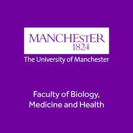

We are excited to announce the next Northern BUG meeting, which will be held on __Friday 20th September 2024__ at the Michael Smith Building in sunny Manchester. 

The Michael Smith Building is about a 15 minute walk from Oxford Road train station, and about a 30 minute walk from Piccadilly train station. There are regular bus services to and from the [train stations](https://www.tfgm.com/plan-a-journey).
 
# The meeting:
The event will include a keynote talk from _Prof. Karen Piper-Hanley: 'A multi-modal approach to define the patho-architecture and cell state transitions during human liver fibrosis'_, and there is an optional morning workshop _'Basics of Multi-omics data: technologies and methods'_.
 
# Call for speakers and poster presentations:
This event is for everyone. We invite you to contribute to its success by submitting your abstracts for talks (both short 20 minutes talks, and 5 minutes flash talks) and poster presentations.   
 
The BUG is a friendly community and this will be an excellent opportunity to get feedback from other bioinformaticians about your project. We particularly welcome abstracts from people wishing to: talk about real world bioinformatics issues; share methods; problem solve a project; or seeking feedback at the early stage of a project.
 
# Prizes:
To recognise exceptional contributions, we will award £100 for the best talk and the best poster presentations. Take this opportunity to share your work, you could be a winner!
 
# Limited Spaces:
Please note that spaces for this event are limited. Priority will be given to presenters and those who register early. Don't delay!

# Registration:
Secure your spot and register now by following this [registration link](https://forms.gle/nQpV2DE4LvuEQheCA)

# Agenda:

| Time          | Speaker        | Presentation | Information |
|---------------|----------------|--------------|-------------|
| 10:00-10:30   | **Registration opens and Tea/coffee** | |   Registration open all day |
| 10:30-12:00   | Optional Workshop | Basics of Multi-omics data: technologies and methods | |
| 12:00-13.00   | **Lunch and Posters** | | |
| 13:00 - 13.40 | Karen Piper-Hanley - University of Manchester | A multi-modal approach to define the patho-architecture and cell state transitions during human liver fibrosis | |
| 13:40 - 15.00 | **Short talks 1**      | | |
|    | Eva Caamaño Gutierrez - University of Liverpool  | Robust Omics Biomarker Identification by Machine Learning – TRUTH or DARE?  | |
|    | Dave Gerrard - University of Manchester |  GenomicLayers - Simple, sequence-anchored simulation of epi-genomes    | |
|    | Muhammad Ahtazaz Ahsan - University of Manchester  | Predicting Pathway Expression from Histopathology Images Using Deep Learning  | |
|    | Matthew Birket - University of Manchester  | Understanding the regulation of cell diversity in cardiac differentiation using gene editing and single cell genomics  | |
| 15:00 - 15.20 |   **Tea/coffee**    | | |
| 15.20 - 15.40 | **Flash talks**  | | |
|    | William Morgans - University of Manchester |  Scalable joint non-negative matrix factorisation for analysis of paired single cell gene expression and chromatin accessibility data | |
|    | Matthew Roberts - Cancer Research UK Manchester Institute |  Efficient and transparent analyses with Shiny apps    | |
|    | Jorge Peinado Izaguerri - University of Manchester  | Optimization of peptide selection for absolute protein quantification using QconCATs  | |
|    | Tengyue Zheng - Manchester NHS FOUNDATION TRUST  | Critique of cloud platforms for NGS processing, should we all jump on BOARD?  | |
| 15.40 - 17.00 | **Short talks 2 & Prizes** | | |
|    | Amin Ali - Cancer Research UK Manchester Institute | Bioinformatic landscape of prostate zones in cancer evolution | |
|    | Sankari Nagarajan - University of Manchester  | Subtype matters- identification of gene regulatory networks in breast cancers  | |
|    | Francis Gyapong - University of Nottingham | The effects of environmental metals on the spread of antimicrobial resistance genes in the stickleback skin microbiome | |
|    | Seung Hyun Lee - Cancer Research UK Manchester Institute  | Integrating histopathology, Co-Detection by Indexing (CODEX) highly multiplexed imaging and computational analysis to create a single cell resolution atlas of human pancreatic cancer development | |
| 17.00 - 19.00 | **Drinks reception**  | | |

# Contact:
For any query please contact Ian Donaldson (ian.donaldson@manchester.ac.uk), Syed Murtuza Baker (syed.murtuzabaker@manchester.ac.uk), Mudassar Iqbal (mudassar.iqbal@manchester.ac.uk)

NorthernBUG 13 is supported by Faculty of Biology, Medicine and Health at University of Manchester    

